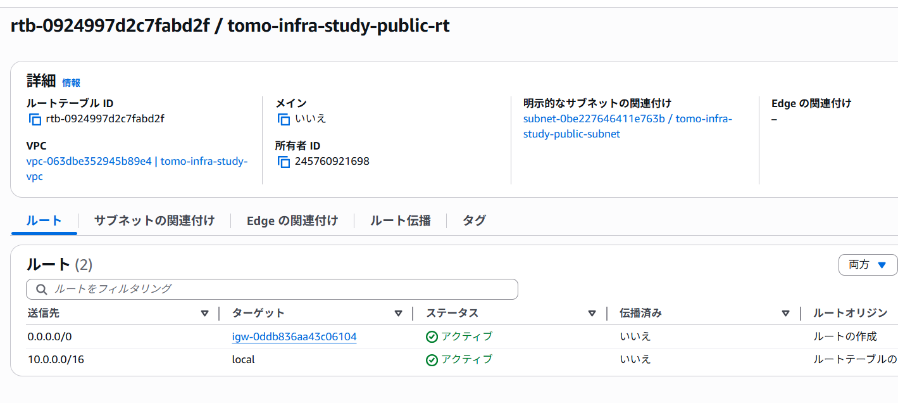
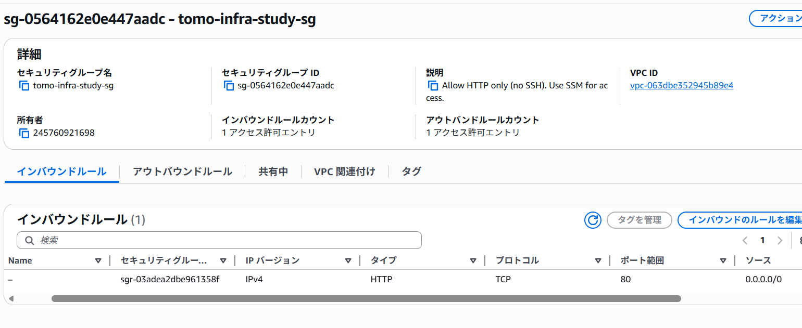

# 2025-12-20 学習ログ

## やったこと
- Terraformでネットワーク土台（VPC / Public Subnet / IGW / Route Table / Association / Security Group）を作成
- `terraform validate` / `terraform plan` / `terraform apply` で作成手順を一通り実施
- AWSコンソール（VPC）で実際に作成されたリソースを確認
- `.gitignore` により `terraform.tfstate` をGitHubへ上げない方針を確認
- `terraform destroy` で作成したリソースを削除（後片付けまで完了）

## 成果（できたこと）
- Terraformの基本フロー（validate → plan → apply → state管理 → destroy）を体験できた
- AWS側で「作ったものが見える」ことをコンソールで確認できた
- 依存関係を考慮した削除（Association→Subnet→IGW→VPC…など）がTerraformで自動的に行われることを体験できた
- tfstateをGitHubに上げない（状態ファイルはローカル管理）という安全な運用を理解できた

## 実施内容（要点）
### Terraform コマンド（dev環境）

```bash
cd infra/envs/dev

terraform validate
terraform plan
terraform apply

terraform state list
terraform destroy

```

### apply結果
```text
Apply complete! Resources: 6 added, 0 changed, 0 destroyed.
```

### state確認（作成直後）
```text
data.aws_availability_zones.available
aws_internet_gateway.this
aws_route_table.public
aws_route_table_association.public
aws_security_group.web
aws_subnet.public
aws_vpc.this
```

### destroy後
```text
Destroy complete! Resources: 6 destroyed.
```

## AWSコンソールで確認したポイント
- VPC: tomo-infra-study-vpc（CIDR: 10.0.0.0/16）
- Subnet: tomo-infra-study-public-subnet（CIDR: 10.0.1.0/24）
- Internet Gateway: tomo-infra-study-igw がVPCにアタッチされている
- Route Table: 0.0.0.0/0 -> igw-... のルートがある
- Security Group: tomo-infra-study-sg（インバウンドはHTTP(80)のみ、SSH(22)は作らない方針）






## ハマりポイント / 学び
- terraform destroy は applyしたディレクトリ（stateがある場所） で実行しないと「0 destroyed」になる
　- 理由：stateが無い場所だと、Terraformが「管理対象（何を消すか）」を判断できない
　- 正しい手順：cd infra/envs/dev で destroy する
- terraform.tfstate は GitHub に上げない
　- gitignore で除外し、リポジトリ直下の git status で確認する
- data は「既にAWS側にある情報を読む」（例：AZ一覧）
- resource は「作る対象（Terraformが管理するもの）」
- apply後に state list で「Terraformが何を管理してるか」が見える
- 使い終わったら destroy までやると安心（課金＆ゴミ防止）